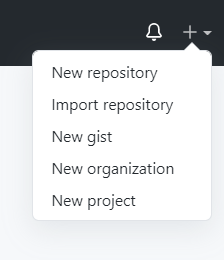
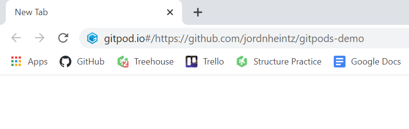
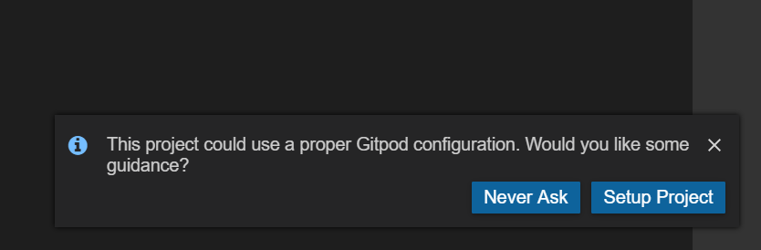
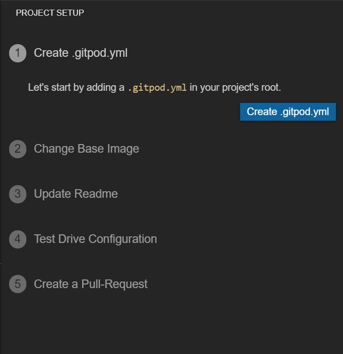
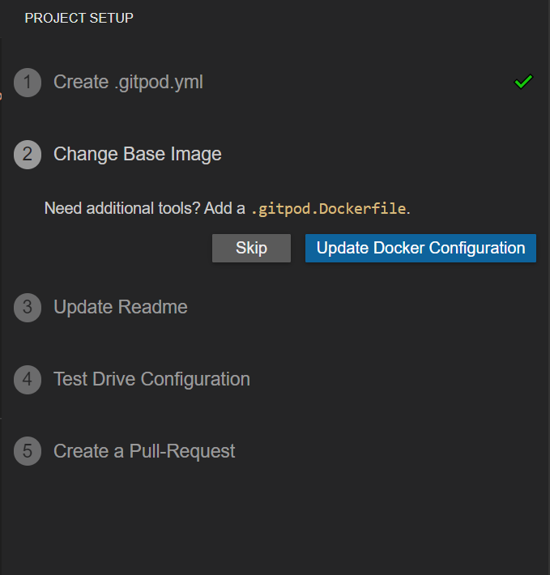
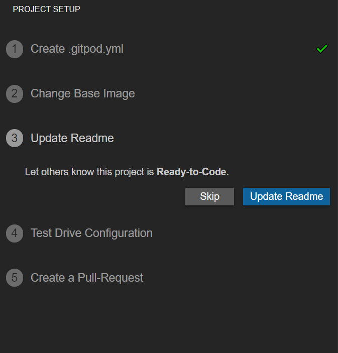
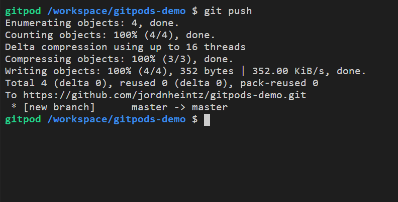

 
 

# GitPod Walk-Through

This walk-through will help guide students/employees in using GitHub with GitPods. 

Chromebooks do not allow the use of Git. GitPods serves a work-around. Git commands are able to be used. 

Students will need their own GitHub and GitPod accounts prior to the project set up. 

GitPod documentation can be found here [GitPod Docs](https://www.gitpod.io/docs/).

1. Create a new repository within GitHub or fork an existing repository.

 

2. Open a new tab and add this GitPod prefix *gitpod.io/#* in the address bar.

 

3. Copy and paste the repository's URL after the prefix. Hit `Enter`.

    - First time users should be prompted to authorize GitPods with GitHub.

    

     

    - If not, go to the home page of GitPod. Click the GitHub avatar icon and select `Access Control`.

        - Check all of the boxes regarding GitHub permissions and Update.

        

         

3. After authorization, a workspace will open to the GitPod IDE.

    

     

4. Now the project must be configured. Click `Setup Project`.

    

     

5. Click `Create .gitpod.yml` and hit `Enter`.

    

     

6. They will be prompted to `Change Base Image`. This is not necessary, click `Skip`.

    

 

7. The `README.md` does not need to be updated by GitPod, users can enter in their own information into the `README.md`. Click `Skip`.

    

 

8. They will be prompted to `Test Configuration` by allowing GitPod to push to the remote branch. This isn't necessary but can be helpful. A student/employee can do their own testing by creating a file or updating the README.md then stage, commit, and push the changes.

    

 

 
 

## Good To Know

- GitPod has a free tier that can be used by students/employees.

    - Free tier does not open workspaces for private repositories.

    - The Free tier has limitations. A user is allotted 50 hours per month. Each month will start with 50 hours. 

    - Hours are calculated when a workspace is running (student/employee coding).

    - Workspaces should be turned off when not in use. 

        - While watching videos, during group discussions, or after work.

    - Users have the ability to turn workspaces on and off from the IDE or from the Workspaces page. Workspaces can also be deleted if needed. 

        - There is a limit to the number of workspaces that can be created and opened. 

        - Sometimes deleting unused workspaces allows a user to gain back hours. This is not always a fix.

            > If 50 hours are accrued before the end of the month, workspaces become inaccessible. It is imperative that users are always **pushing up their work** to avoid code loss. Code can still be retrieved from GitHub.

    - GitPod allows users to see the amount of hours remaining by:

        - If in a workspace, click the GitPod avatar icon and select `Account`. A small window will appear and display your GitHub account username and the remaining usage time. 

        - If on the Workspaces page, click the GitHub avatar icon and select `My Usage`.

    - A GitPod extension can be added to the browser for easy access. 

    - A GitPod button can be added to GitHub and will appear in every repository. 
         

