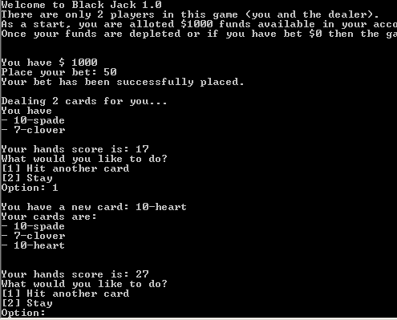

 
 

# JavaScript Game Project for Instructors

## About

This project is for employees/students to complete as they work through the courses in Treehouse:

- Scrum Basics
- JS Basics
- JS Numbers
- JS Functions
- JS Loops
- JS Arrays

The games will not incorporate HTML or CSS and should be coded to be ran in the Console. 

## The Set-Up

- Choose **ONE** game from the options below
- Create a repository with the name of the game.
- Submit an Issue with GitHub repo URL to this repository.

## The Task

Choose **ONE** of the following games to code:

- Pong

    

    JS Pong Game
    https://codeheir.com/2019/02/04/how-to-code-pong-1972-1/

    - Does not involve the DOM
    - All JavaScript and HTML
    - CSS can be used to improve the overall look.

 
 
 

- Tic Tac Toe

    

    JS Tic Tac Toe Game
https://medium.com/javascript-in-plain-english/the-worlds-most-empowering-tic-tac-toe-javascript-tutorial-a889e4c20883

    - Minimal HTML & CSS but can be incorporated
    - Does use the DOM
    - Mostly documentQuerySelectAll and document.getElementById
    - Incorporates if/else statements, nested arrays

 
 
 

- Connect Four

    

    JS Connect 4 Game
    https://www.101computing.net/connect4-challenge/

    HTML & CSS are needed
    Uses the DOM (document.getElementById)

 
 
 

- BlackJack

    

    JS BlackJack
    http://www.jsmadeeasy.com/javascripts/Games/Blackjack/index.htm

    Very little HTML but can be expanded on
    Employees can incorporate their own CSS
    Uses the DOM document.display

 
 
 

## The Requirements

In their first sprint, they will learn JavaScript basics, including Numbers, Arrays, Functions, and Loops. 

Their code must include the following:

- Functions
- Loops  
- Arrays

The game needs to be coded to run in the Console. No HTML or CSS is needed for the project.

